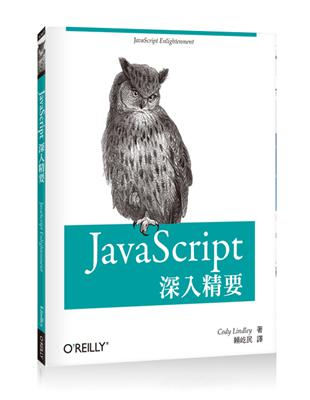

# JavaScript 深入精要

作者：Cody Lindley   
譯者：賴屹民   
出版年份：2013




---

＊ 只記錄摘要，並非全部內容

- [Ch1 JavaScript 物件](#ch1-javascript-物件)
- [Ch2 JavaScript 應用物件與屬性](#ch2-javascript-應用物件與屬性)
- [Ch3 Object()](#ch3-object)
- [Ch4 Function()](#ch4-function)


---

## Ch1 JavaScript 物件

### JavaScript 有九種原生物件建構式

- Number()
- String()
- Boolean()
- Object()
- Array()
- Function()
- Date()
- RegExp()
- Error()

>  ＊ Math 是一個靜態物件，不需要 new 運算子


建構函式把他想像成一個餅乾模具，用途是建立預先設定好的物件，透過 new 運算子，建立一個實例 (instance)


使用 new 將原生建構式實例化
```
const myNumber = new Number(23);
console.log(myNumber.constructor) // logs Number() 
```

---

### JavaScript 字面值 (literal)
```
const myNumber = new Number(23); // 物件
const myNumberLiteral = 23; // 原始數字值，不是物件
```

原始字串 / 數字 / 布林，在你使用方法或建構式的屬性時，JavaScript 會先將它包裝成物件，可讓你用物件的方式處理他，結束呼叫方法後，再回傳字面值類型

 > JavaScript 的所有事物都具有類似物件的行為

 ---

### 原始值 / 簡單值 / 單純值 (primitive)

- strings
- numbers
- booleans
- null
- undefined
- BigInt
- Symbol

Ｑ 如何 儲存 / 複製 原始值？

儲存或是複製原始值，我們都是在使用“字面值”，會以字面值的形式儲存在記憶體中。

> by value 去處理

可以被當成物件使用的原始值

- strings
- numbers
- booleans

```
let primitiveString = "foo";
console.log(primitiveString.toString()) // string
```

---

### 複合值

- Object()
- Array()
- Function()
- Date()
- Error()
- RegExp()

Ｑ 如何 儲存 / 複製 複合值？

> by reference 去處理

他會複製位於記憶體堆疊中的儲存位置和參考，而不是實際的值，也就是說，JavaScript 不會複製物件。

物件要相等，要指向同一個記憶體位置才會相等。

---


要小心 null 是屬於物件類型
```
console.log(typeof null) // object
```

---

### 所有的建構式實例都有他們的建構式屬性，並指向他們的建構式函式

當實例化任何物件之後，會私下產生 constructor 屬性來作為該物件屬性，他會指向建立該物件的建構函式。

```
let foo = {};

console.log(foo.constructor == Object) // true
console.log(foo.constructor) // 指向 Object 建構函式 ƒ Object() { [native code] }
```
---

### 驗證物件是否是某特定建構式函式的實例

`instanceOf` 只可以於複合物件或是建構式函式所建立的實例。

```
let CustomConstructor = function() { this.foo = 'bar' }
let instanceOfCustomObject = new CustomConstructor();
console.log(instanceOfCustomObject instanceOf CustomConstructor) // true
```

---

### 實例可以擁有自己的專屬屬性

```
let myArray = new Array();
myArray.prop = 'test';

console.log(myArray.prop) // test
```

---

## Ch2 JavaScript 應用物件與屬性

### 刪除物件屬性

delete 是唯一真正可以移除物件屬性的方法，設定成 null / undefined 只會更改變屬性的值。

```
let foo = { bar:bar };
delete foo.bar;

console.log( 'bar' in foo ) // false
```

---

### 如何解析物件屬性的參考

當回傳 undefined 前，JavaScript 會先去尋 `Array.prototype` 尋找 `Array.prototype.foo` 找不到再去 `Object.prototype` 找，再找不到才返回 undefined。
```
let myArray = [];

console.log( myArray.foo ) // undefined
```

所有的物件實例都有一個屬性秘密連結到建立該實例的建構函式 `__proto__`。
使用 `hasOwnProperty` 來確定某物件屬性是否來自於原型鏈

```
let myArray = ['foo','bar'];

console.log(myArray.join()) // 實際上，join() 被定義於 Array.prototype.join;

console.log(myArray.hasOwnProperty('join')) // false 
```


```
let myArray = ['foo','bar'];
console.log(myArray.toLocaleString()) toLocaleString() 被定義於 Object.prototype.toLocaleString;
```

---

### 使用 `in` 運算子來檢查物件是否具有此屬性

`in` 除了可以檢查物件中屬性，也可以看看該物件是否有從 prototype 中繼承到某屬性，有的話就回傳 `true` 沒有則回傳 `false`。


```
let myObject = {'foo': 'bar'};

console.log('toString' in myObject) // true
```

---

### ＊使用 `for...in` 列舉出物件屬性

```
let cody = {
    age: 23,
    gender: 'male' // 物件最後一項逗號要移除，在某些環境會發生錯誤
}

for (let key in cody){
    // 跳過從原型鏈繼承的屬性，不加上會列出繼承屬性
    if(cody.hasOwnProperty(key)){
        console.log(key)
    }
}
```

---

### host 物件 vs 原生物件

列出 `host` 物件
```
for(let x in window){
    console.log(x) // 列出 window/head 物件的所有屬性
}
```

列出 `瀏覽器環境提供的 window.document` 物件中的所有物件
```
for(let x in window.document){
    console.log(x)
}
```

---


## Ch3 Object()

### 使用 Object() 創建一個物件

沒帶上參數會預設為 null 或是 undefined

```
let a = new Object('foo') // String {'foo'}
```

---

### *Object() 屬性與方法

屬性

- prototype

### *Object() 物件實例屬性與方法

屬性

- constructor

方法

- hasOwnProperty()
- isPrototypeOf()
- propertyIsEnumerable()
- toLocaleString()
- toString()
- valueOf()

原型鏈以 Object.prototype 結束，因此 JavaScript 物件會繼承 Object() 的所有屬性和方法

---


### 使用物件字面值（object literal）建立 Object 物件

```
let cody = {
    age: 23,
    gender: 'male'
}
```

---

### 從 `Object.prototype` 繼承的所有物件

```
Object.prototype.foo = 'foo'

let myString = 'bar';

console.log(myString.foo) // foo 從 Object.prototype 繼承
```

加到 Object.prototype 裡的事物都會在 `for...in` 迴圈 和原型鏈中顯示，所以要小心使用，可以的話不要用。

---

## Ch4 Function()


---

## Ch12 Boolean

會是 false 的情況 

- 0
- -0
- null
- false
- undefined
- '' 空字串
- Nan


---

## Ch14 Null

某個物件屬性沒有值，會設定成 null，將來可能會有值

```
console.log(typeof null) // object
```

驗證 null 值時，一定要使用 ===，因為 == 無法分辨 null 和 undefined
```
let myObject = null;

console.log(myObject === null) // true
```

---

## Ch15 undefined 

1. 已宣告的變數，但並未賦值
2. 嘗試存取的變數尚未被定義，而且無法在原型鏈中找到